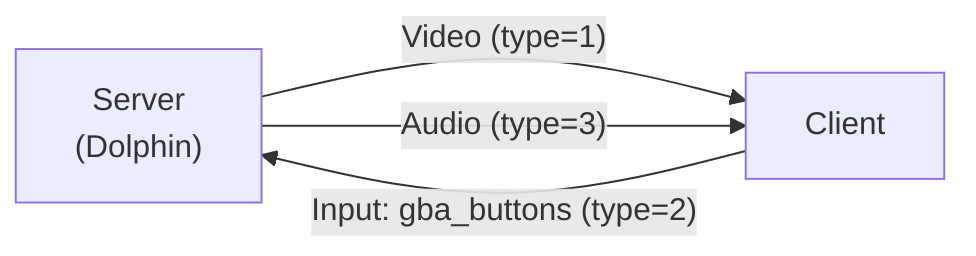
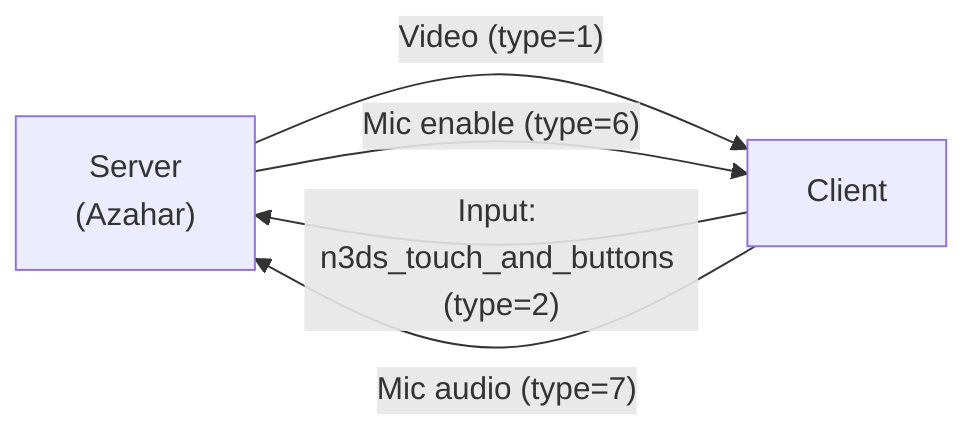
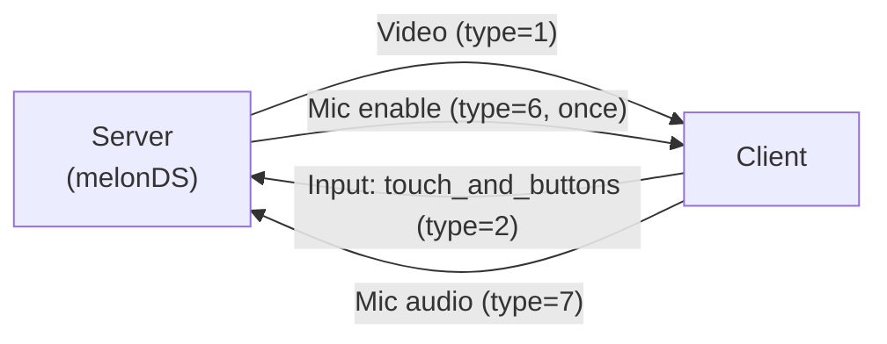
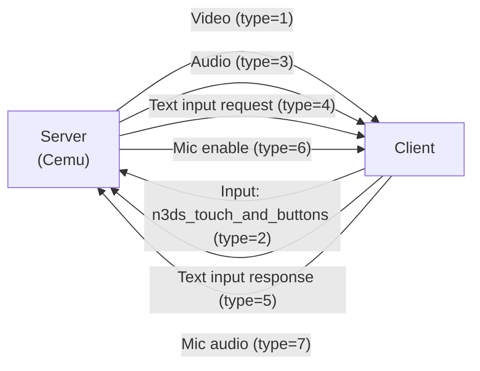

# finlink wire protocol

Single source of truth for the WebSocket protocol every client and server in this ecosystem
implements against. Reference implementations live in four emulator forks, none part of this repo
— see the root [`README.md`](../README.md#context) for an overview of all four and
[Stream Types](#stream-types) below for what each one streams. The original and most fully
documented is dolphin-gba-stream (Dolphin), whose `GBAStreamHost`/`GBAStreamLobby` classes this
document uses as concrete illustrative examples throughout — the protocol itself is
emulator-agnostic and every fork's server follows the same shape (see [Endpoints](#endpoints)
below). Starting with `protocol_version = 2` (see below), this document also describes the
discovery beacon, connection handshake (including slot negotiation), and downscaling negotiation
— before that there was no mechanism for any of it; see this file's git history for the plain
`Video`/`Audio`/`Input` state without a handshake.

## Endpoints

| Server | Port | Purpose |
|---|---|---|
| Lobby | `6800` (TCP) | Handshake entry point (see below), one per finlink server instance, independent of which stream slot ends up serving the client. Named `GBAStreamLobby` in dolphin-gba-stream specifically — a reference-counted singleton there, replacing that fork's earlier HTML picker page. |
| Stream host (× slot) | `6801`–`6804` (TCP) | One slot per active stream (e.g. one GC port set to "GBA (Client Stream)" in dolphin-gba-stream). Exactly one connected client per port. For stream types with only a single slot (see below), this range isn't used — the session stays on `6800`. Named `StreamHost` in dolphin-gba-stream specifically. |
| Discovery beacon | `6805` (UDP, broadcast) | Periodic server announcement, see [Discovery Beacon](#discovery-beacon-udp). |

> Since `protocol_version = 2`, the lobby distinguishes between a plain `GET /` (returns an HTML
> page, status 200 — the WASM-based web client, now built on `core/`) and a WebSocket upgrade
> request (triggers the handshake below). All five clients (Android, 3DS, Switch, NDS/DSi, Web) now
> speak the full app handshake on the player ports (6801–6804) and use the
> [UDP discovery beacon](#discovery-beacon-udp) to find a server — the earlier
> `probeLobby()`/subnet-sweep implementations on 3DS/Switch/NDS have been fully replaced.

## Protocol version

`protocol_version` is a simple, monotonically increasing integer. Current value: **2**.
Compatibility rule: **exact match** — a client with `protocol_version = 2` only connects to a
server that also reports exactly `2`, and vice versa. No major/minor scheme; any protocol change
that affects this document increments the value by 1.

`protocol_version` appears in two places:

1. In the [discovery beacon](#discovery-beacon-udp) — lets the client already flag an incompatible
   server in the server list, before even attempting a connection.
2. In the `hello` message of the [handshake](#connection-setup-handshake) — the final, authoritative
   check, in case a client connects directly without (or ignoring) the beacon.

A client **must** abort the connection attempt on a version mismatch and show a user-understandable
error message, e.g.:

> Server speaks protocol version 3, this client only supports version 2 —
> please update the client or the server.

Silently ignoring it, crashing, or an unclear hung state are explicitly wrong behavior. This also
applies to the case where no `hello` message arrives at all within 3000 ms of the WebSocket upgrade
(typically a server that doesn't know the handshake at all, effectively `protocol_version = 1`) —
handle this identically to a version/compatibility error client-side, just with adjusted wording
("server doesn't support this protocol" instead of a concrete version number).

## Discovery beacon (UDP)

Every server sends a UDP broadcast packet on port `6805` every **2000 ms** (subnet broadcast or
`255.255.255.255`), JSON-encoded, UTF-8, one packet per broadcast (no fragmentation):

```json
{
  "type": "finlink_beacon",
  "protocol_version": 2,
  "emulator_identifier": "Dolphin",
  "game_title": "Pokémon Mystery Dungeon: Red Rescue Team",
  "stream_type": "GC_GBA_LINK",
  "host": "192.168.1.42",
  "handshake_port": 6800
}
```

- `type`: fixed string marker `"finlink_beacon"`, allows cheaply discarding UDP noise from other
  applications on the same port before parsing the rest.
- `protocol_version`: see above.
- `emulator_identifier`: free-form string, e.g. `"Dolphin"`, `"Azahar"` — display only, not an
  enum (a new emulator doesn't need a protocol change).
- `game_title`: the currently running game title. **Only relevant for server search/listing**,
  deliberately not part of the handshake — a game change within a running session isn't supported,
  so there's no need to retransmit or update this field after connection setup.
- `stream_type`: see [Stream Types](#stream-types). A server announces exactly the one type it's
  offering at that moment.
- `host` / `handshake_port`: target address for the full handshake once the user picks this
  server. `handshake_port` is `6800` for every currently known stream type, but is transmitted
  explicitly instead of being hardcoded, for future flexibility.

Client-side behavior: collect/update incoming beacons in a list keyed by `(host, handshake_port)`;
an entry with no new beacon for **>6000 ms** (three missed intervals) is considered gone and
removed from the list. An entry with a differing `protocol_version` is still shown (transparency:
the server is there, after all), but flagged as incompatible and not selectable — see
[Protocol Version](#protocol-version).

This logic belongs platform-independently in `core/` (not in an individual client shell), the same
as the existing WebSocket/protocol logic there.

Known and deliberately deferred: the beacon is unauthenticated, another device on the same LAN
could theoretically send spoofed values. Not a must for private use on your own network for now,
see the backlog in the project brief.

## Stream types

An extensible enum, transmitted as a string (not a number/bitmask) — an unknown string can be
unambiguously treated client-side as "don't know this one", without risk of being confused with an
invalid numeric combination:

| `stream_type` | Meaning | Slots | Audio | Microphone |
|---|---|---|---|---|
| `GC_GBA_LINK` | Dolphin's built-in GBA emulation (GC↔GBA Link Cable) | 4 (P1–P4) | yes | no |
| `N3DS_BOTTOM_SCREEN` | Azahar, bottom screen (320×240) | 1 | no | yes |
| `NDS_BOTTOM_SCREEN` | melonDS, bottom screen (256×192) | 1 | no | yes |
| `WIIU_GAMEPAD` | Cemu, GamePad screen (854×480) | 1 | yes | yes |

Stream types without audio (`N3DS_BOTTOM_SCREEN`, `NDS_BOTTOM_SCREEN`) omit the `audio` field in
`hello` (`null`/absent), and the audio negotiation in `hello_ack` is skipped entirely — in this
case there is never a `type=3` audio message on the connection at any point.

The "Microphone" column is independent of the "Audio" column and is **not** part of the
`hello`/`hello_ack`/`session_ready` negotiation — there's no `hello` field announcing microphone
support. A server that implements it simply sends `type=6` messages as soon as the emulated
microphone is actively needed (see "Microphone Input" under
[WebSocket Binary Frames](#websocket-binary-frames)); a client without a microphone implementation
ignores `type=6` unhandled and never sends a `type=7` back, which for the server is equivalent to
"no microphone available" — not an error state, no abort.

How often a server actually sends `type=6` is an implementation detail and depends on whether the
respective console even has a "microphone actively requested right now" signal at all: Cemu
(`WIIU_GAMEPAD`) and Azahar (`N3DS_BOTTOM_SCREEN`) have such a signal (`MICStatus.isOpen` or an
equivalent) and send `type=6` exactly on every change of that state (a level signal, see below).
melonDS (`NDS_BOTTOM_SCREEN`) has no comparable signal at this level — there, `type=6`
(`enabled=1`) is sent once, right after `session_ready`, and never again afterward, not even at
connection end (no `enabled=0`).

### Data flow per stream type

Which binary frame types (see [WebSocket Binary Frames](#websocket-binary-frames)) flow in which
direction, per `stream_type` and its reference implementation (all after the handshake, see
[Connection Setup](#connection-setup-handshake)):

**`GC_GBA_LINK`** (Dolphin, `dolphin-gba-stream` fork):



**`N3DS_BOTTOM_SCREEN`** (Azahar, `src/core/streaming/`):



No `type=3` (audio): Azahar deliberately doesn't forward DS/3DS speaker audio, only the microphone
in the reverse direction.

**`NDS_BOTTOM_SCREEN`** (melonDS, `src/streaming/`):



No `type=3` (audio), for the same reason as `N3DS_BOTTOM_SCREEN`. `type=2` here uses
`"touch_and_buttons"`, not `"n3ds_touch_and_buttons"` — no analog-stick field, since the DS has no
analog stick.

**`WIIU_GAMEPAD`** (Cemu, `src/Cemu/finlinkStream/`):



The only stream type with every message type so far active at once: GamePad speaker audio plays
exclusively on the client (local playback is muted meanwhile, see `ax_out.cpp`/`AIInitDRCDMA`),
GamePad microphone runs in the reverse direction, and `swkbd` (the Wii U's software keyboard) uses
text input instead of a local overlay, since that would never be captured by the video capture
(see "Text Input" below).

### Target screen on second-screen clients (3DS, DS/DSi)

`N3DS_BOTTOM_SCREEN`, `NDS_BOTTOM_SCREEN`, and `WIIU_GAMEPAD` are themselves already the *second
screen* of a remote dual-screen source — on a client with two screens of its own (3DS, DS/DSi),
their image therefore always lands on that client's own bottom/second screen, regardless of an
otherwise selectable screen setting (which only applies to single-screen types like
`GC_GBA_LINK`). `core/`'s `finlink_stream_type_prefers_secondary_screen()`
(`finlink/handshake.h`) encapsulates exactly this mapping, so it doesn't need to be duplicated in
every client.

## Connection setup: handshake

Before the first `Video`/`Audio`/`Input` binary frame (see below), server and client exchange up
to four possible JSON text messages (WebSocket opcode `0x1`, not `0x2`). Framing rules (unmasked
server frames, masked client frames, no fragmentation, see
[WebSocket Transport](#websocket-transport-rfc6455-and-binary-framing)) apply identically to text
and binary frames. Each message is a single JSON object with a required `"message"` field as
discriminator.

### Sequence

```
Client                                    Server (port 6800, GC_GBA_LINK example)
  |--- WebSocket upgrade (RFC6455) ------->|
  |<-- hello -------------------------------|
  |--- hello_ack --------------------------->|
  |<-- session_ready { redirect: 6801 } ----|      (only for stream types with >1 slot)
  (WS connection closes; new connection to port 6801)
  |--- WebSocket upgrade (RFC6455) ------->|
  |<-- hello -------------------------------|
  |--- hello_ack --------------------------->|
  |<-- session_ready (no redirect) ---------|
  |<== from here on: Video (1) / Audio (3), Input (2) as usual ==>|
```

For stream types with exactly one slot (`N3DS_BOTTOM_SCREEN`, and in the future
`NDS_BOTTOM_SCREEN`), the redirect step is skipped: `session_ready` already arrives on the
port-6800 connection without a `redirect` field, and that same connection then carries the stream
too — there's no use of 6801–6804 for these types.

### `hello` (server → client)

The first message, sent unsolicited by the server right after the WebSocket upgrade:

```json
{
  "message": "hello",
  "protocol_version": 2,
  "stream_type": "GC_GBA_LINK",
  "slots": [
    { "index": 0, "label": "P1", "occupied": false },
    { "index": 1, "label": "P2", "occupied": true },
    { "index": 2, "label": "P3", "occupied": false },
    { "index": 3, "label": "P4", "occupied": false }
  ],
  "video": { "width": 240, "height": 160, "pixel_format": "rgb565", "fps": 59.7275 },
  "audio": { "sample_rate": 32768, "channels": 2 },
  "input_encoding": "gba_buttons"
}
```

- `slots`: for `GC_GBA_LINK`, the four GC ports. For single-slot types, an array with exactly one
  entry (`index: 0`) — the same message shape stays uniform across every stream type this way,
  even where the choice is trivial there.
- `video` / `audio`: **native** parameters, as actually produced by the emulator core,
  independent of what the client requests afterward. `audio` is absent (or `null`) for stream
  types without audio transmission.
- `input_encoding`: name of the input encoding this stream type expects on this connection
  (`type=2` messages, see below). `"gba_buttons"` is the existing `u16le` bitmask format,
  unchanged; `"n3ds_touch"` is touch position + press status; `"n3ds_touch_and_buttons"`
  (`N3DS_BOTTOM_SCREEN`, `WIIU_GAMEPAD`) additionally bundles buttons and up to two analog sticks
  into one frame; `"touch_and_buttons"` (`NDS_BOTTOM_SCREEN`) is the same without the analog-stick
  fields, for consoles with no analog input at all — see
  [WebSocket Binary Frames](#websocket-binary-frames).

### `hello_ack` (client → server)

The client's reply:

```json
{
  "message": "hello_ack",
  "protocol_version": 2,
  "requested_slot": 0,
  "video_limits": { "max_width": 240, "max_height": 160, "max_fps": 60, "max_bitrate_kbps": null },
  "audio_limits": { "max_sample_rate": 32768, "max_channels": 2 }
}
```

- `protocol_version`: the client's own supported version — lets the server do a defensive second
  check (see [Protocol Version](#protocol-version)); but the client already primarily checks
  `hello.protocol_version` before even replying.
- `requested_slot`: index from the `hello`'s `slots` list. Always `0` for single-slot types.
- `video_limits`: upper bounds the client can handle. `max_bitrate_kbps` is optional (`null` = no
  known/desired limit) and only serves the server as a rough hint on how aggressively to downscale.
- `audio_limits`: absent (or `null`) if the client doesn't want/can't handle audio, **or** if
  `hello.audio` was already absent (a stream type without audio) — in that case there's nothing to
  negotiate here.

### `session_ready` (server → client)

Confirmation after matching native parameters against the client's limits — native values take
priority as long as the client can handle them per `hello_ack`, otherwise the server downscales:

```json
{
  "message": "session_ready",
  "slot": 0,
  "video": { "width": 240, "height": 160, "fps": 59.7275 },
  "audio": { "sample_rate": 32768, "channels": 2 }
}
```

Optionally with an additional `"redirect": { "host": "192.168.1.42", "port": 6801 }` — only for
stream types with more than one slot. If `redirect` is set, **this** connection carries no
video/audio/input frames at all; the server closes it after sending. The client opens a new
WebSocket connection to `redirect.host:port` and goes through the same `hello`/`hello_ack`/
`session_ready` exchange there again (with the same limits/the same `requested_slot`) — this time
without `redirect` in the reply. The second round is deliberately a complete repeat rather than a
token/session handoff: in dolphin-gba-stream specifically, this keeps `GBAStreamHost` independent
of `GBAStreamLobby` (no shared reservation state needed between the two objects), and more
generally makes each of the two connections fully self-explanatory on its own regardless of how a
given fork's lobby and stream host are actually implemented.

`audio` is absent from `session_ready` if it was already absent from `hello`.

After a `session_ready` without `redirect`, the server starts sending `Video`/`Audio` binary
frames at the (possibly downscaled) `width`/`height`/`sample_rate`/`channels`. The existing binary
format itself (the frame header already carries `width`/`height` per frame, see below) does
**not** change for downscaling — downscaling is purely a server-side decision about which
resolution/frame rate/sample rate to encode at, before the existing header+deflate pipeline takes
over.

### `handshake_error` (server → client)

Replaces `session_ready`, can arrive in its place at any point after `hello_ack` (or instead of a
`hello`, if the server already knows in advance that it can't serve the client — e.g. a version
failure with no need to wait):

```json
{
  "message": "handshake_error",
  "code": "slot_unavailable",
  "detail": "Slot P2 was taken by another client in the meantime."
}
```

`code` ∈ `version_mismatch`, `slot_unavailable`, `malformed_request` (extensible). `detail` is
human-readable text the client is allowed to display directly (doesn't need to translate it itself
per `code`, but should additionally evaluate `code` for programmatic behavior, e.g. to
automatically re-request the updated `slots` list on `slot_unavailable` instead of aborting
entirely).

The server closes the connection right after sending `handshake_error` (no separate close frame,
see [WebSocket Transport](#websocket-transport-rfc6455-and-binary-framing)) — there's no mechanism
to reply with a new `hello_ack` on the same connection. "Automatically re-request" therefore means:
open a new WebSocket connection to the same handshake endpoint and start a new `hello`/`hello_ack`
exchange there, not reuse the same socket.

`slot_unavailable` is a normal, expected case (a race between two clients picking the same free
slot between `hello` and `hello_ack`) — not a bug, not an exceptional situation, the client UI
should handle it correspondingly undramatically (e.g. "Slot P2 is now occupied, please pick
another" instead of a generic error message).

## WebSocket, binary frames

| Direction | Type | Format |
|---|---|---|
| Server → client | `1` (Video) | `[u8 type=1][u32le width][u32le height][u8 format][raw-deflate-compressed block]` |
| Client → server | `2` (Input, `input_encoding = "gba_buttons"`) | `[u8 type=2][u16le keyBitmask]` |
| Client → server | `2` (Input, `input_encoding = "n3ds_touch"`) | `[u8 type=2][u8 pressed][u16le x][u16le y]` |
| Client → server | `2` (Input, `input_encoding = "n3ds_touch_and_buttons"`) | `[u8 type=2][u8 pressed][u16le touchX][u16le touchY][u32le buttons][s16le leftX][s16le leftY][s16le rightX][s16le rightY]` |
| Client → server | `2` (Input, `input_encoding = "touch_and_buttons"`) | `[u8 type=2][u8 pressed][u16le touchX][u16le touchY][u32le buttons]` |
| Server → client | `3` (Audio) | `[u8 type=3][u32le sampleRate][u8 channels][s16le PCM samples]` |
| Server → client | `4` (Text input request) | `[u8 type=4][u32le maxLength][u32le textLen][utf8 text]` |
| Client → server | `5` (Text input response) | `[u8 type=5][u8 confirmed][u32le textLen][utf8 text]` |
| Server → client | `6` (Mic enable) | `[u8 type=6][u8 enabled][u32le sampleRate]` |
| Client → server | `7` (Mic audio) | `[u8 type=7][u32le sampleRate][u8 channels][s16le PCM samples]` |

These binary frames (opcode `0x2`) occur exclusively **after** a successful handshake
(`session_ready` without `redirect`, see above) on the same connection. Content unchanged from the
pre-handshake version of the protocol; `width`/`height`/`sampleRate`/`channels` in the headers
mirror the (possibly downscaled) values confirmed in `session_ready`.

All four `type=2` variants share the same message type — which variant applies on a given
connection is fixed once at handshake time by `hello.input_encoding` (see above), not by an
additional discriminator byte in the frame itself.

Input bitmask bit order (bit 0 = LSB, `"gba_buttons"`): `A, B, Select, Start, Right, Left, Up, Down, R, L`

`"n3ds_touch"` (pure touch, no buttons -- the pure touch part that
`"n3ds_touch_and_buttons"` and `"touch_and_buttons"` below both take
over): `x`/`y` are pixel coordinates in the respective stream type's
native grid, as declared in `hello.video`/`session_ready.video`'s
`width`/`height` (`320x240` for `N3DS_BOTTOM_SCREEN`, `256x192` for
`NDS_BOTTOM_SCREEN`, `854x480` for `WIIU_GAMEPAD`) — how a client maps its
own input (touch, mouse, stick, ...) onto this area is entirely its own
business. No currently implemented server reports this pure encoding in
`hello.input_encoding` anymore (all three stream types mentioned have
since moved to one of the two button extensions) — it remains as its own
name regardless, for a future stream type with touch but no buttons at
all. `pressed = 0` means **released**; `x`/`y` are meaningless in that
case and must be `0` — a release has no meaningful position, it's simply
"no longer touching", not "touch ended at (x,y)". A drag is transmitted as
a sequence of `pressed = 1` frames with updated `x`/`y`, no separate
message type is needed for it.

`"n3ds_touch_and_buttons"` (currently `N3DS_BOTTOM_SCREEN` and `WIIU_GAMEPAD`, despite the name
likewise not 3DS-specific) is a superset of `"n3ds_touch"`: the same touch part (now called
`touchX`/`touchY`, identical `pressed = 0` semantics as above), plus buttons and up to two analog
sticks in **one** combined frame, instead of several separate message types. A client resends the
complete frame on any change to any part (touch, a button, a stick), not just the changed field —
the server has no mechanism to merge partial updates.

- `buttons`: a generic bitmask, a superset of every button any touch-capable stream type could
  remotely accept. A server only evaluates the bits its own console actually has; a client without
  a corresponding button simply never sets that bit, a server without that button ignores it
  safely:

  | Bit | Value | Meaning |
  |---|---|---|
  | 0 | `0x0001` | A |
  | 1 | `0x0002` | B |
  | 2 | `0x0004` | X |
  | 3 | `0x0008` | Y |
  | 4 | `0x0010` | L |
  | 5 | `0x0020` | R |
  | 6 | `0x0040` | ZL |
  | 7 | `0x0080` | ZR |
  | 8 | `0x0100` | Select (aka Minus on Wii U) |
  | 9 | `0x0200` | Start (aka Plus on Wii U) |
  | 10 | `0x0400` | Digital Up |
  | 11 | `0x0800` | Digital Down |
  | 12 | `0x1000` | Digital Left |
  | 13 | `0x2000` | Digital Right |
  | 14 | `0x4000` | Home |

- `leftX`/`leftY`, `rightX`/`rightY`: analog stick state, signed `-32768..32767` per axis, `(0, 0)`
  = resting/centered. `left` is the 3DS Circle Pad, or, for a console with two sticks
  (`WIIU_GAMEPAD`), its left stick; `right` is always `(0, 0)` for a console with at most one
  analog stick.

Reference implementation:
[`../core/include/finlink/protocol.h`](../core/include/finlink/protocol.h)
(`finlink_extended_input`, `finlink_button_bit`,
`finlink_build_extended_input_frame`, `finlink_parse_extended_input_frame`).

`"touch_and_buttons"` (currently only `NDS_BOTTOM_SCREEN`) is the same idea as
`"n3ds_touch_and_buttons"` -- touch + buttons in one combined frame, the same `buttons` bitmask
(see table above) -- but for a console with no analog input at all (the DS only has a digital
D-pad): no `leftX`/`leftY`/`rightX`/`rightY` in the frame, instead of four fields that could only
ever be `0` there anyway. Its own, smaller struct/wire shape rather than reusing
`finlink_extended_input` with padding.

Reference implementation:
[`../core/include/finlink/protocol.h`](../core/include/finlink/protocol.h)
(`finlink_touch_and_buttons`, `finlink_build_touch_and_buttons_frame`,
`finlink_parse_touch_and_buttons_frame`).

All multi-byte fields are little-endian.

### Video frame payload (`format`-dependent)

The `format` byte sits **before** the compressed block (uncompressed) and is a bitmask of two
independent flags that together determine the content of the unpacked block. The server
automatically picks the cheapest combination per frame — clients must support all four
combinations, not just `format = 0`.

- Bit 0 (`0x01`, INDEXED): pixels are palette indices (1 byte) instead of raw color (`u16le`
  RGB565).
- Bit 1 (`0x02`, TILES): only the 8×8 tiles that changed since the last frame actually sent are
  included, plus a list of which ones. Every other pixel keeps its value from the last frame — the
  client's framebuffer must therefore persist across frames, not be recreated per frame. If the
  bit is absent, it's the complete image (overwrites the whole framebuffer).

Unpacked block, in this order (each section present only if its corresponding bit is set):

```
[ if TILES:   u16le tile_count
              tile_count × u16le tile_index ]
[ if INDEXED: u16le palette_count            (1-256)
              palette_count × u16le RGB565 ]
pixel_data:   if TILES:   tile_count × 64 pixels (8×8, row-major per
                          tile, in tile_index list order)
              else:       width × height pixels (row-major, whole image)
              Pixel:      1 byte palette index (INDEXED) or u16le
                          RGB565 (otherwise)
```

`tile_index` ↔ position: `tiles_per_row = ceil(width/8)`; `tile_col =
tile_index % tiles_per_row`, `tile_row = tile_index / tiles_per_row`
(integer division); tile's pixel origin = `(tile_col*8, tile_row*8)`.

The very first frame after connection setup always has TILES unset server-side (full image, no
previous frame to diff against) — this also serves as a keyframe. Clients must reset their own
framebuffer on (re)connection, so no leftovers from an old session are visible before this first
frame.

Pixel color: for INDEXED, `color = palette[index]`, then as before
`r=(color>>11)&0x1F, g=(color>>5)&0x3F, b=color&0x1F`.

Reference implementation: [`../core/include/finlink/protocol.h`](../core/include/finlink/protocol.h)
(`finlink_video_format`, `finlink_decode_video_frame`,
`finlink_video_max_inflated_size`).

### Text input (server → client / client → server)

Some emulator cores show their own host-side software keyboard as a UI overlay over the emulated
framebuffer for text entry (save-state name, friend code, search term, …) — e.g. Cemu's `swkbd` —
but the video capture reads directly from the emulated framebuffer/scan buffer, not from the
composited window, so it never sees this overlay. `type=4`/`type=5` replace that for the remote
client with its own native text entry.

`type=4` (text input request, server → client):
`[u8 type=4][u32le maxLength][u32le textLen][utf8 text]`

- `maxLength`: maximum character count (not bytes), `0` = no server-side limit.
- `text`/`textLen`: already-present/pre-filled text (often empty), UTF-8, **not** NUL-terminated.

The client then shows its own native text entry (system keyboard) pre-filled with `text` and
`maxLength` as the character limit.

`type=5` (text input response, client → server):
`[u8 type=5][u8 confirmed][u32le textLen][utf8 text]`

- `confirmed = 0`: the user canceled — `text`/`textLen` are meaningless in this case (the server
  keeps its existing text unchanged), a client typically sends an empty string here.
- `confirmed = 1`: the user confirmed, `text` is the entered value.

Reference implementation:
[`../core/include/finlink/protocol.h`](../core/include/finlink/protocol.h)
(`finlink_text_input_request`, `finlink_text_input_response`).

### Microphone input (server → client / client → server)

Lets a console's emulated microphone (e.g. the 3DS's `mic:u` service) be fed from the connected
client's real microphone instead of a host device. Not part of the
`hello`/`hello_ack`/`session_ready` negotiation (see [Stream Types](#stream-types)) — a server
simply sends `type=6` as soon as it needs it; a client without a microphone implementation ignores
it unhandled.

`type=6` (mic enable, server → client):
`[u8 type=6][u8 enabled][u32le sampleRate]`

Mirrors real microphone hardware: the physical microphone is only active while a game has switched
it on and is actively sampling — not continuously just because a connection exists. A server sends
this on every change of that state (a **level** signal, not edge/toggle — can be resent with the
same value any number of times without anything changing for the client). `sampleRate` is
meaningless when `enabled = 0`. A client then starts (or stops) recording from its own microphone,
at `sampleRate` (no client-side conversion needed — Android, for instance, accepts any sample rate
directly and resamples internally).

`type=7` (mic audio, client → server):
`[u8 type=7][u32le sampleRate][u8 channels][s16le PCM samples]`

Identical byte layout to `type=3` (audio), just the reverse direction — `type=3` is always
server → client (console/speaker audio), `type=7` always client → server (microphone input).
`channels` is always `1` (mono) for every currently known microphone implementation — every
console with a microphone input here only accepts one channel.

Reference implementation:
[`../core/include/finlink/protocol.h`](../core/include/finlink/protocol.h)
(`finlink_mic_enable`, `finlink_build_mic_enable_frame`,
`finlink_parse_mic_enable_frame`, `finlink_parse_mic_audio_frame`).

## WebSocket transport (RFC6455) and binary framing

Server-side, the WebSocket handling itself (not just the app-layer protocol above) is typically
hand-rolled by each emulator fork rather than using a standard WS library — e.g.
dolphin-gba-stream's `GBAStreamHost::PerformHandshake`, `TryParseWebSocketFrame`,
`SendWebSocketBinaryFrame`. Relevant for clients, especially on platforms without their own WS
client (3DS/Switch homebrew):

- Handshake is standard RFC6455: `Sec-WebSocket-Key` → `SHA1(key + "258EAFA5-
  E914-47DA-95CA-C5AB0DC85B11")` → Base64 → `Sec-WebSocket-Accept`, to be verified by the client.
  (Not to be confused with the app-layer "handshake" from
  [Connection Setup](#connection-setup-handshake) above, which builds on top of this.)
- Server frames are always unmasked, `FIN=1`, opcode `0x2` (binary) for video/audio or `0x1` (text)
  for the handshake JSON messages, 7/16/64-bit length field depending on payload size.
- Client frames must be sent **masked** per RFC, regardless of opcode.
- **No fragmentation** (`FIN=0` counts as a protocol error, neither sent nor accepted by the
  server), **no ping/pong**, **no `permessage-deflate`** — the deflate compression happens
  exclusively manually on the video payload (see above), not at the WS level.
- The server sends no close frame back when closing; after sending/receiving a close frame
  (opcode `0x8`), just close the TCP connection. This also applies to the server-side teardown
  after a `redirect` in `session_ready`.

Client-side implementation of this part lives in
[`../core/include/finlink/websocket.h`](../core/include/finlink/websocket.h).

## Frame semantics (video dedup)

The server skips video frames that are pixel-identical to the last frame sent. A missing new video
message is therefore normal, not a timeout/error state — clients simply keep displaying the last
received image.

## HTTP

`GET /status` — only on player ports (6801–6804), not on the lobby.

```json
{ "occupied": true }
```

The response has CORS headers set. Since the handshake was introduced (`slots` in `hello`, see
above), this is **no longer the primary way** to learn slot occupancy — the handshake delivers the
same information atomically as part of connection setup, avoiding the race between "poll status"
and "then connect separately". `/status` remains as a secondary/diagnostic endpoint, but is no
longer needed for new client implementations. The lobby (port 6800) has no HTTP equivalent of
`/status` across all four player ports — the `slots` list in the handshake replaces that. A plain
`GET /` there still serves HTML (see the note under [Endpoints](#endpoints)), but that's the web
client, not a discovery mechanism for the native clients — those use the UDP beacon.

## Known limitations / open questions

- The discovery beacon is unauthenticated (see [Discovery Beacon](#discovery-beacon-udp)) —
  hardening against that is deliberately deferred.
- There's no server-side slot reservation between `hello` and `hello_ack` — two clients can
  request the same free slot at the same time; the loser gets `handshake_error` with
  `code = "slot_unavailable"` and has to pick again themselves (see above). This is expected
  behavior, not a bug.
- Whether RGB565+raw-deflate works unchanged for `N3DS_BOTTOM_SCREEN` (320×240, larger than the
  GBA's 240×160) or a different codec is needed remains open — to be resolved during the Azahar
  implementation, not part of this protocol revision.
